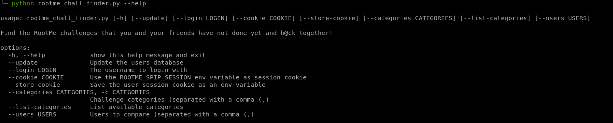
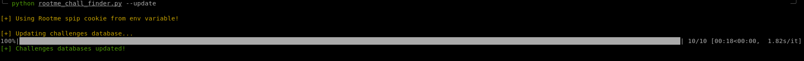
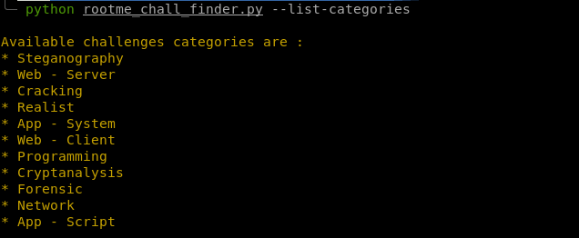
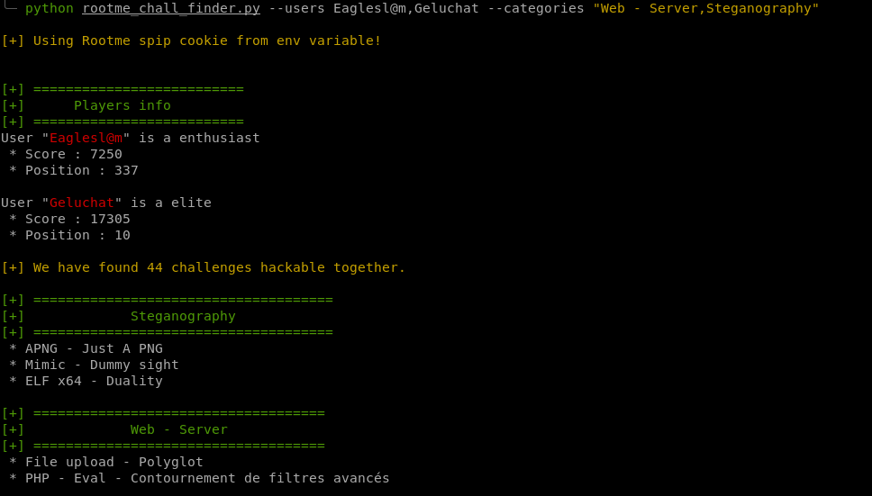
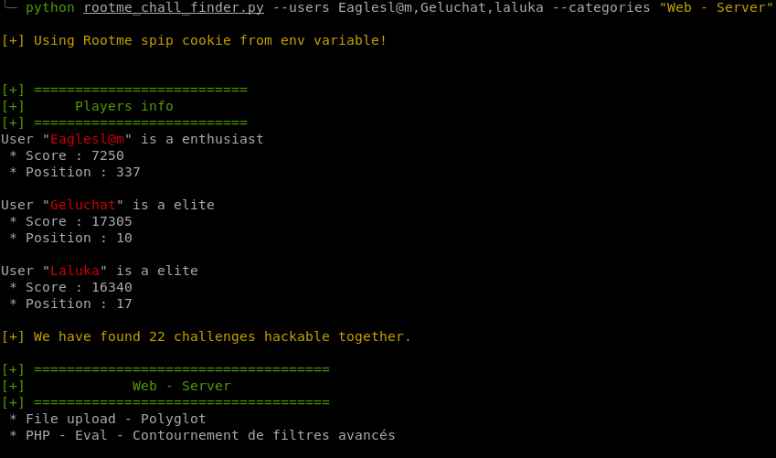

# RootMe Challenge Finder

## Description
`RootMe Challenges Finder` is a little script to find which challenges are not yet solved by you and your friends. You can use this to find the good box to try hard during your geeky evenings!

## Setup

The tool runs with `python3`.  
Please make sure to install the dependencies with the following command.

```bash
git clone git@github.com:jdouliez/rootme-challenges-finder.git
cd rootme-challenges-finder
pip3 install -r requirements.txt
python3 rootme_chall_finder.py --help
```

The easiest way to authenticate is to pass the login form on the website and get the `spip_session` cookie from your browser. An integrated way to login is implemented but does not work properly yet.

## How to use

```bash
$> python3 ./rootme_chall_finder.py --help
usage: rootme_chall_finder.py [-h] [--update] [--login LOGIN]
                              [--cookie COOKIE] [--store-cookie]
                              [--categories CATEGORIES] [--list-categories]
                              [--users USERS]

Find the RootMe challenges that you and your friends have not done yet and
h@ck together!

options:
  -h, --help            show this help message and exit
  --update              Update the users database
  --login LOGIN         The username to login with
  --cookie COOKIE       Use the ROOTME_SPIP_SESSION env variable as session cookie
  --store-cookie        Save the user session cookie as an env variable
  --categories CATEGORIES, -c CATEGORIES Challenge categories (separated with a comma (,)
  --list-categories     List available categories
  --users USERS         Users to compare (separated with a comma (,)

```

First thing to do is to get the challenges on a local database.  
You can do this with the `--update` options.

**Update the database**  
```bash
$> python3 ./rootme_chall_finder.py --update

[+] Using Rootme spip cookie from env variable!

[+] Updating challenges database...
100%|██████████████████████████████████████████████████████████████████████████████████████████| 10/10 [00:18<00:00,  1.84s/it]
[+] Challenges databases updated!
```

**Get the challenges categories list**  
```bash
$> python3 ./rootme_chall_finder.py --list-categories

Available challenges categories are : 
* Steganography
* Web - Server
* Cracking
* Realist
* App - System
* Web - Client
* Programming
* Cryptanalysis
* Forensic
* Network
* App - Script
```

**Use an authentication mechanisms**  
* `--login` : Use you username and password
* `--cookie` : Provide your spip_session cookie
* if none, the tool will check if a global env named `ROOTME_SPIP_COOKIE` exists and contains the cookie


**Provide users**  
Use the `--users` with a list of usernames to compare challenges.  
You can add as many usernames as you want. 

```bash
$> python3 ./rootme_chall_finder.py --users Geluchat,Jrmbt

[+] Using Rootme spip cookie from env variable!


[+] ==========================
[+]      Players info        
[+] ==========================
User "Geluchat" is a elite
 * Score : 17305
 * Position : 10

User "Jrmbt" is a elite
 * Score : 16940
 * Position : 12

[+] We have found 36 challenges hackable together.

[+] =====================================
[+]             Steganography            
[+] =====================================

[+] ====================================
[+]             Web - Server            
[+] ====================================
 * PHP - Configuration Apache
 * File upload - Polyglot
 * PHP - Eval - Contournement de filtres avancés

[+] ================================
[+]             Cracking            
[+] ================================
 * Bash - VM
 * ELF x64 - KeyGenMe
 * ELF x64 - Hidden Control Flow
 * WASM - Trouvez le PNJ

[+] ===============================
[+]             Realist            
[+] ===============================
 * Root Me, for real

[+] ====================================
[+]             App - System            
[+] ====================================
 * WinKern x64 - Stack buffer overflow avancé - ROP
 * WinKern x64 - Use After Free
 * ELF x64 - File Structure Hacking
 * ELF x64 - FILE structure hijacking
 * ELF x64 - ret2dl_init
 * ELF x64 - Heap Filling
 * ELF x64 - Advanced Heap Exploitation - Heap Leakless &amp; Fortified
 * ELF x64 - Buggy VM
 * ELF x64 - Heap Safe-Linking Bypass

[+] ====================================
[+]             Web - Client            
[+] ====================================
 * CSS - Exfiltration
 * XSS DOM Based - AngularJS
 * CSP Bypass - Nonce
 * DOM Clobbering
 * XS Leaks

[+] ===================================
[+]             Programming            
[+] ===================================

[+] =====================================
[+]             Cryptanalysis            
[+] =====================================
 * FEAL - Cryptanalyse différentielle
 * Side Channel - AES&nbsp;: CPA
 * PHP - mt_rand
 * Side Channel - AES&nbsp;: premier round

[+] ================================
[+]             Forensic            
[+] ================================
 * Find me on Android
 * iOS - Introduction
 * The Lost Case - Investigation Mobile

[+] ===============================
[+]             Network            
[+] ===============================
 * RF - Key Fixed Code
 * RIPv1 - no authentication
 * RF - Transmission satellite
 * RF - Bande L

[+] ====================================
[+]             App - Script            
[+] ====================================
 * Docker - I am groot
 * Docker - Talk through me
 * Docker - Sys-Admin&#8217;s Docker
```
**Filter on categories**  
```bash
$> python3 ./rootme_chall_finder.py --users Geluchat,Jrmbt --categories Cracking,Network

[+] Using Rootme spip cookie from env variable!


[+] ==========================
[+]      Players info        
[+] ==========================
User "Geluchat" is a elite
 * Score : 17305
 * Position : 10

User "Jrmbt" is a elite
 * Score : 16940
 * Position : 12

[+] We have found 36 challenges hackable together.

[+] ================================
[+]             Cracking            
[+] ================================
 * Bash - VM
 * ELF x64 - KeyGenMe
 * ELF x64 - Hidden Control Flow
 * WASM - Trouvez le PNJ

[+] ===============================
[+]             Network            
[+] ===============================
 * RF - Key Fixed Code
 * RIPv1 - no authentication
 * RF - Transmission satellite
 * RF - Bande L
```

## Examples











## PR
Pull request are welcomed !  
Feel free to participate.

## Fix/ToDo
* The /login endpoint from the Rootme API returns "429 Too many request" all the time. Wuut..
* The script do not save the cookie into a env var with the `--store-cookie` option (?)
* Do not display empty categories if no chall are available
